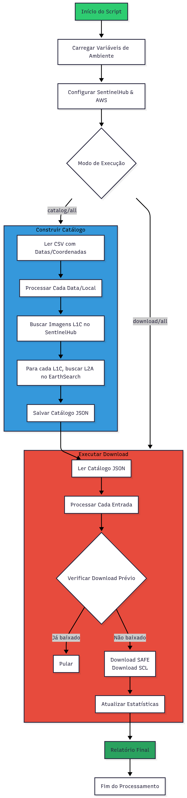

# Río Negro Matchup

Python package and scripts to:  
- Find and download [Sentinel 2] satellite imagery to matchup with water quality field measurements;  
- Run [ACOLITE](https://hypercoast.org/) atmospheric correction and water quality models;  
- Validate models derived from satellite imagery with field measurements;  

# Overview



# Use Examples

## Organizing module
It will look for Water Quality data, clean and organize it.

In case of using OAN's field campaigns data:
```python
python rionegromatchup/Organizing.py --mode campaigns
```
This process will read campaigns data, organize and clean its values, and then merge with stations data, writing the results to `./data/monitoring_data/campaigns_organized.csv`

Or using OAN's realtime monitoring data:
```python
python rionegromatchup/Organizing.py --mode realtime
```
As realtime monitoring data produces one file for each station, all files will be read and stacked into one DataFrame then merged with stations coordinates.
The results will be written to `./data/monitoring_data/Automatic_WQ_monitoring_stations.csv`

## Sentinel Pipeline Module

The `sentinel_pipeline.py` script automates the process of finding and downloading Sentinel-2 imagery that matches field measurement dates and locations.

### Key Features:
- **Dual Catalog Search**: Uses both SentinelHub (L1C products) and EarthSearch (L2A products)
- **Smart Matching**: Finds imagery within configurable time windows around field dates
- **Cloud Filtering**: Filters images by maximum cloud cover percentage
- **Duplicate Prevention**: Checks for existing downloads before downloading
- **Dual Download**: Downloads both SAFE products and SCL (Scene Classification) assets
- **Comprehensive Reporting**: Provides detailed statistics of download operations

### Workflow:
1. **Catalog Creation**: Searches for matching Sentinel-2 images
2. **Download Execution**: Downloads SAFE products and optional SCL assets
3. **Verification**: Checks for existing files to avoid duplicates

### Create catalog only:

```bash
python sentinel_pipeline.py --mode catalog \
  --csv data/monitoring_data/campaigns_organized.csv \
  --output data/sentinel_downloads \
  --time-delta 2 \
  --cloud-cover 20
```

### Download images from existing catalog (with SCL assets):

```bash
python sentinel_pipeline.py --mode download \
  --catalog-json data/sentinel_catalog.json \
  --output data/sentinel_downloads \
  --download-scl \
  --only-first
```

### Create catalog and download images in one step:

```bash
python sentinel_pipeline.py --mode all \
  --csv data/monitoring_data/campaigns_organized.csv \
  --output data/sentinel_downloads \
  --time-delta 1 \
  --cloud-cover 10 \
  --download-scl \
  --only-first
```

### Full download (all matching images):

```bash
python sentinel_pipeline.py --mode all \
  --csv data/monitoring_data/campaigns_organized.csv \
  --output data/sentinel_downloads \
  --time-delta 2 \
  --cloud-cover 15 \
  --download-scl
```

## Command Line Arguments

### Required Arguments:
- `--mode`: Operation mode - `catalog`, `download`, or `all`
- `--csv`: Input CSV file with field measurement data (requires 'date', 'longitud', 'latitud' columns)
- `--output`: Output directory for downloaded files

### Optional Arguments:
- `--catalog-json`: Catalog JSON file path (default: `sentinel_catalog.json`)
- `--time-delta`: Days to search around field dates (default: 1)
- `--cloud-cover`: Maximum cloud cover percentage (default: 10)
- `--only-first`: Download only the first matching image per date/location
- `--download-scl`: Download SCL (Scene Classification) assets alongside SAFE products

## Input CSV Format
The input CSV should contain the following columns:
- `date`: Measurement date in YYYY-MM-DD format
- `longitud`: Longitude coordinate (decimal degrees)
- `latitud`: Latitude coordinate (decimal degrees)

## Output Structure
```
output_directory/
├── sentinel_catalog.json          # Image catalog
├── S2A_MSIL1C_XXXXXXXX_XXXX/      # SAFE product folder
├── S2B_MSIL1C_XXXXXXXX_XXXX/      # SAFE product folder
├── S2A_MSIL1C_XXXXXXXX_XXXX_SCL.tif  # SCL classification map
└── S2B_MSIL1C_XXXXXXXX_XXXX_SCL.tif  # SCL classification map
```

## Environment Variables
Create a `.env` file with the following credentials:
```env
SH_CLIENT_ID=your_sentinelhub_client_id
SH_CLIENT_SECRET=your_sentinelhub_client_secret
DATASPACE_ACCESS_KEY=your_copernicus_dataspace_access_key
DATASPACE_SECRET_KEY=your_copernicus_dataspace_secret_key
```

## Data Sources
- **Sentinel-2 L1C**: Copernicus Dataspace (via SentinelHub)
- **Sentinel-2 L2A**: EarthSearch AWS STAC Catalog
- **SCL Assets**: Scene Classification Maps from L2A products

The pipeline efficiently matches field measurements with satellite overpasses and downloads the necessary data for subsequent atmospheric correction and water quality analysis with ACOLITE.