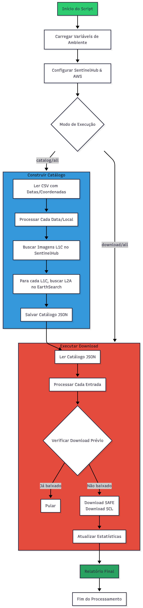

# Río Negro Matchup

Python package and scripts to:  
- Find and download [Sentinel 2] satellite imagery to matchup with water quality field measurements;  
- Run [ACOLITE](https://hypercoast.org/) atmospheric correction and water quality models;  
- Validate models derived from satellite imagery with field measurements;  

# Overview



# Use Examples

## Organizing module
It will look for Water Quality data, clean and organize it.

In case of using OAN's field campaigns data:
```python
python rionegromatchup/Organizing.py --mode campaigns
```
This process will read campaigns data, organize and clean its values, and then merge with stations data, writing the results to `./data/monitoring_data/campaigns_organized.csv`

Or using OAN's realtime monitoring data:
```python
python rionegromatchup/Organizing.py --mode realtime
```
As realtime monitoring data produces one file for each station, all files will be read and stacked into one DataFrame then merged with stations coordinates.
The results will be written to `./data/monitoring_data/Automatic_WQ_monitoring_stations.csv`

## Sentinel Pipeline Module

The `sentinel_pipeline.py` script automates the process of finding and downloading Sentinel-2 imagery that matches field measurement dates and locations.

### Key Features:
- **Dual Catalog Search**: Uses both SentinelHub (L1C products) and EarthSearch (L2A products)
- **Smart Matching**: Finds imagery within configurable time windows around field dates
- **Cloud Filtering**: Filters images by maximum cloud cover percentage
- **Duplicate Prevention**: Checks for existing downloads before downloading
- **Dual Download**: Downloads both SAFE products and SCL (Scene Classification) assets
- **Comprehensive Reporting**: Provides detailed statistics of download operations

### Workflow:
1. **Catalog Creation**: Searches for matching Sentinel-2 images
2. **Download Execution**: Downloads SAFE products and optional SCL assets
3. **Verification**: Checks for existing files to avoid duplicates

### Create catalog only:

```bash
python rionegromatchup/sentinel_pipeline.py --mode catalog \
  --csv data/monitoring_data/campaigns_organized.csv \
  --time-delta 2 \
  --cloud-cover 20
```

### Download images from existing catalog (with SCL assets):

```bash
python rionegromatchup/sentinel_pipeline.py --mode download \
  --download-scl \
  --only-first
```

### Create catalog and download images in one step:

```bash
python rionegromatchup/sentinel_pipeline.py --mode all \
  --csv data/monitoring_data/campaigns_organized.csv \
  --time-delta 1 \
  --cloud-cover 10 \
  --download-scl \
  --only-first
```

### Full download (all matching images):

```bash
python rionegromatchup/sentinel_pipeline.py --mode all \
  --csv data/monitoring_data/campaigns_organized.csv \
  --time-delta 2 \
  --cloud-cover 15 \
  --download-scl
```

### Command Line Arguments

#### Required Arguments:
- `--mode`: Operation mode - `catalog`, `download`, or `all`
- `--csv`: Input CSV file with field measurement data (requires 'date', 'longitud', 'latitud' columns)
- `--output`: Output directory for downloaded files

#### Optional Arguments:
- `--catalog-json`: Catalog JSON file path (default: `sentinel_catalog.json`)
- `--time-delta`: Days to search around field dates (default: 1)
- `--cloud-cover`: Maximum cloud cover percentage (default: 10)
- `--only-first`: Download only the first matching image per date/location
- `--download-scl`: Download SCL (Scene Classification) assets alongside SAFE products

### Input CSV Format
The input CSV should contain the following columns:
- `date`: Measurement date in YYYY-MM-DD format
- `longitud`: Longitude coordinate (decimal degrees)
- `latitud`: Latitude coordinate (decimal degrees)

### Output Structure
```
output_directory/
├── sentinel_catalog.json          # Image catalog
├── S2A_MSIL1C_XXXXXXXX_XXXX/      # SAFE product folder
├── S2B_MSIL1C_XXXXXXXX_XXXX/      # SAFE product folder
├── S2A_MSIL1C_XXXXXXXX_XXXX_SCL.tif  # SCL classification map
└── S2B_MSIL1C_XXXXXXXX_XXXX_SCL.tif  # SCL classification map
```

### Environment Variables
Create a `.env` file with the following credentials:
```env
SH_CLIENT_ID=your_sentinelhub_client_id
SH_CLIENT_SECRET=your_sentinelhub_client_secret
DATASPACE_ACCESS_KEY=your_copernicus_dataspace_access_key
DATASPACE_SECRET_KEY=your_copernicus_dataspace_secret_key
```

[See documentation](https://documentation.dataspace.copernicus.eu/APIs/S3.html#example-script-to-download-product-using-boto3) for more info about KEY and Secret

## Data Sources
- **Sentinel-2 L1C**: Copernicus Dataspace (via SentinelHub)
- **Sentinel-2 L2A**: EarthSearch AWS STAC Catalog
- **SCL Assets**: Scene Classification Maps from L2A products

The pipeline efficiently matches field measurements with satellite overpasses and downloads the necessary data for subsequent atmospheric correction and water quality analysis with ACOLITE.

## ACOLITE Atmospheric Correction Module

The `acolite_spec.py` module provides a spec-driven configuration and execution interface for [ACOLITE](https://github.com/acolite/acolite), the atmospheric correction tool developed at RBINS for aquatic remote sensing applications.

ACOLITE applies the Dark Spectrum Fitting (DSF) algorithm to Sentinel-2 L1C SAFE products and outputs surface reflectances and derived water quality parameters as NetCDF files.

### Prerequisites

You need the ACOLITE binary installed on your system. Download it from the [REMSEM page](https://odnature.naturalsciences.be/remsem/software-and-data/acolite) or [See ACOLITE repository](https://github.com/acolite/acolite/releases) to get the newest version.
The path to the binary file will be necessary to run ACOLITE.

### Key Features:
- **Spec-driven configuration**: All ACOLITE parameters are defined as typed Python dataclasses with documented defaults
- **Grouped settings**: Parameters are organised into logical sections — I/O, atmospheric correction (RAdCor), TACT, glint correction, L2W products, and output format
- **Validation**: Configuration is validated before execution (executable path, bounding box consistency, parameter ranges)
- **Settings file export**: Serialises the full configuration to an ACOLITE-compatible `key=value` settings file
- **Subprocess execution**: Calls the ACOLITE binary as a subprocess and returns paths to the generated outputs
- **Dry-run mode**: Previews the command and settings without executing

### Configuration sections

| Section | Dataclass | Controls |
|---|---|---|
| I/O & ROI | `IOConfig` | Input SAFE path, output directory, bounding box or polygon |
| Atmospheric correction | `RadCorConfig` | DSF method, tile size, ancillary data, ozone/WV/pressure |
| Thermal correction | `TACTConfig` | TACT enable, emissivity, reanalysis source (Sentinel-2: disabled) |
| Glint correction | `GlintConfig` | Method, threshold, residual glint masking |
| Water quality products | `L2WConfig` | L2W parameter list, pixel masking, reflectance outputs |
| Export | `OutputConfig` | GeoTIFF, COG, NetCDF compression, RGB quicklook |

### Minimal usage

```python
from rionegromatchup.acolite_spec import AcoliteConfig, IOConfig

cfg = AcoliteConfig(
	acolite_executable = '/home/felipe/Downloads/acolite_py_linux_20260421.0/acolite_py_linux/acolite',
        io=IOConfig(
                inputfile="/mnt/Trabalho/repos/RioNegroMatchUp/data/sentinel_downloads/Sentinel-2/MSI/L1C_N0500/2017/07/13/S2A_MSIL1C_20170713T135111_N0500_R024_T21HUD_20230919T094731.SAFE/",
                output="data/acolite_output",
                limit=(-33.249842, -58.450501, -33.174766, -58.325562),   # S, W, N, E,
            ),        
        )
```

### Dry run (preview command and settings without executing)

```python
result = cfg.run(dry_run=True)
```

This prints the full `acolite_settings.txt` content and the exact command that would be called, without touching any data.

```commandline
inputfile=/mnt/Trabalho/repos/RioNegroMatchUp/data/sentinel_downloads/Sentinel-2/MSI/L1C_N0500/2017/07/13/S2A_MSIL1C_20170713T135111_N0500_R024_T21HUD_20230919T094731.SAFE/
output=data/acolite_output
limit=-33.249842,-58.450501,-33.174766,-58.325562
aerosol_correction=dsf
dsf_path_reflectance=tiled
dsf_tile_dimensions=120,120
dsf_minimum_tile_cover=0.1
ancillary_data=true
tact_run=false
glint_correction=true
glint_method=vanhellemont2019
glint_threshold=0.01
glint_mask_rhos=true
glint_mask_rhos_threshold=0.15
l2w_parameters=t_nechad,spm_nechad,chl_oc3,chl_re,aphy_443,fai,ndwi,ndvi
l2w_mask=true
l2w_mask_negative_rhos=true
l2w_mask_cirrus=true
l2w_mask_high_toa=true
l2w_mask_high_toa_threshold=0.3
l2w_mask_water_expr=rhos_1600 < 0.0215
output_rhorc=false
output_rhos=true
export_geotiff=true
export_geotiff_coordinates=true
export_cloud_optimized_geotiff=false
netcdf_compression=true
netcdf_compression_level=4
map_rgb=false
```
### Full run

```python
result = cfg.run()

print("Return code:", result["returncode"])  # 0 = success
print("L2W file:   ", result["l2w_file"])    # path to water quality NetCDF
print("Log file:   ", result["log_file"])    # path to ACOLITE run log
```

### Output structure

After a successful run, the output directory will contain:

```
data/acolite_output/2025-08-01/
├── acolite_settings.txt                     # settings used for this run
├── S2A_MSI_20250801_..._L1R.nc              # top-of-atmosphere radiance
├── S2A_MSI_20250801_..._L2R.nc              # surface reflectance (rhos_*)
├── S2A_MSI_20250801_..._L2W.nc              # water quality products
└── acolite_run_YYYYMMDDTHHMMSS.log          # processing log
```

The L2W NetCDF is the primary output. It contains all requested water quality parameters as 2D arrays at the scene's native resolution, masked to water pixels only.

### Default L2W parameters

The default configuration requests the following bio-optical products:

| Parameter | Description |
|---|---|
| `t_nechad` | Turbidity — Nechad et al. (2010) |
| `spm_nechad` | Suspended Particulate Matter |
| `chl_oc3` | Chlorophyll-a — OC3 algorithm |
| `chl_re` | Chlorophyll-a — Red-Edge (Sentinel-2 only) |
| `aphy_443` | Phytoplankton absorption at 443 nm |
| `fai` | Floating Algae Index |
| `ndwi` | Normalized Difference Water Index |
| `ndvi` | Normalized Difference Vegetation Index |

This list can be customised by overriding `L2WConfig.l2w_parameters` when constructing the config.

### Inspecting the L2W output

```python
import netCDF4 as nc
import numpy as np

ds = nc.Dataset(result["l2w_file"])

# List all available variables
print(list(ds.variables.keys()))

# Check value range for a parameter
chl = ds.variables["chl_oc3"][:]
print(f"chl_oc3 range: {np.nanmin(chl):.3f} – {np.nanmax(chl):.3f} mg/m³")
```

### Building a config from a campaigns row

The `from_campaigns_row()` factory method builds a config directly from a row in the `campaigns_organized.csv`, deriving the bounding box automatically from the station coordinates:

```python
import pandas as pd
from acolite_spec import AcoliteConfig

campaigns = pd.read_csv("data/monitoring_data/campaigns_organized.csv", sep=";")
row = campaigns.iloc[0]

cfg = AcoliteConfig.from_campaigns_row(
    row=row,
    acolite_executable="/path/to/acolite",
    base_output="data/acolite_output",
    inputfile="data/sentinel_downloads/S2A_MSIL1C_20250801.SAFE",
)

result = cfg.run()
```

---

# Tasks

| # | Area | Issue | Priority | Status |
|---|------|-------|----------|--------|
| 1 | Tests | `load_area` imported but doesn't exist in `sentinel_pipeline.py` | High | ✅ Done |
| 2 | Tests | `build_catalog` signature mismatch between tests and implementation | High | ✅ Done |
| 3 | `search_images` | Generator exhausted before loop; `list()` cast misplaced | High | ✅ Done |
| 4 | `search_images` | L2A search runs inside L1C loop but ignores per-item context | High | ✅ Done |
| 5 | `build_catalog` | Hardcoded `sep=";"` incompatible with realtime CSV output (comma-separated) | High | ⏳ Pending |
| 6 | `download_product` | `bucket.download_file` called incorrectly on `boto3` Bucket object | High | ✅ Done |
| 7 | Catalog | No deduplication when same scene covers multiple stations on the same date | Medium | ✅ Done |
| 8 | Spatial | Fixed `buffer_degrees=0.01` with no footprint overlap validation | Medium | ⏳ Pending |
| 9 | Validation | No satellite vs. field measurement comparison implemented | Medium | ⏳ Pending |
| 10 | ACOLITE | No atmospheric correction integration despite being a core project goal | Medium | ✅ Done |
| 11 | Logging | Inconsistent use of `logger` vs. inline strings in download report | Low | ⏳ Pending |
| 12 | CSV separator | `Organizing.py` uses different separators for realtime vs. campaigns output | Low | ⏳ Pending |
