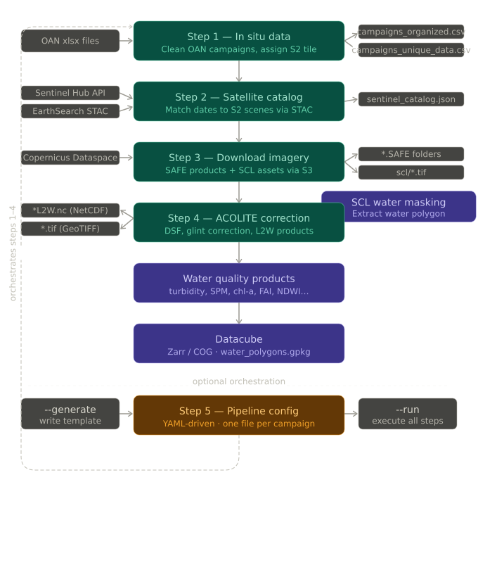

# Aquamatch

Bridging the gap between satellite observations and field data for water quality monitoring.

Aquamatch is a Python package for discovering and downloading Sentinel-2 imagery based on field sampling events, applies atmospheric correction and extracts water quality parameters via ACOLITE, and exports to multiple formats, including data cube and Cloud Optimized GeoTIFF.
Designed for reproducible, automated environmental monitoring workflows — from a single Python call, CLI command, or YAML config.

## Overview



**Color coding**: teal for the five pipeline steps, gray/neutral for data artifacts (CSVs, SAFE folders, outputs), amber for the YAML orchestration layer, and purple for the SCL/datacube components.  
**Dashed arrows**: used for two relationships that are optional or indirect: the SCL polygon clip path (only when use_scl=True), and the Step 5 orchestration edges back to Steps 1–4 (since the YAML config drives the others rather than receiving data from them).

---

## Installation

**Requirements:** Python ≥ 3.12

Clone the repository and install dependencies with [Poetry](https://python-poetry.org/):

```bash
git clone https://github.com/FelipeSBarros/aquamatch.git
cd aquamatch
poetry install
```

Or with pip (using the lock file for reproducibility):

```bash
pip install .
```

> `pyyaml` is required for the pipeline config system. It is included in the project dependencies.

---

## Environment Setup

Create a `.env` file in the project root with your API credentials before running any step:  
* `SH` for SentinelHub (see [documentation](https://sentinelhub-py.readthedocs.io/en/latest/configure.html))  
* `DATASPACE` for Copernicus Dataspace (see [documentation](https://documentation.dataspace.copernicus.eu/APIs/S3.html#example-script-to-download-product-using-boto3))   

```env
SH_CLIENT_ID=your_sentinelhub_client_id    # SentinelHub
SH_CLIENT_SECRET=your_sentinelhub_client_secret    # SentinelHub
DATASPACE_ACCESS_KEY=your_copernicus_dataspace_access_key
DATASPACE_SECRET_KEY=your_copernicus_dataspace_secret_key
```

---

## Step-by-step Workflow

### Step 1 — Prepare in situ data

This package was developed to work with in-situ data from the [OAN](https://www.ambiente.gub.uy/iSIA_OAN/). 
You are therefore expected to save your campaign and station datasets in the './data/original_data' folder.
This step involves reading field campaign data, cleaning measurement values and, if specified, assigning each station its Sentinel-2 tile. Two outputs are produced:

- `campaigns_organized.csv` — full cleaned dataset for analysis
- `campaigns_unique_data.csv` — one row per unique (date, tile) pair, used to drive the satellite search

```python
from aquamatch.insitu_data import run_insitu_pipeline

run_insitu_pipeline(
    stations="data/original_data/my_stations.xlsx",
    campaigns="data/original_data/my_export.xlsx",
)
```

> Pass skip_clean=True if the OAN export was already cleaned before download. [See OAN's documention](https://www.ambiente.gub.uy/iSIA_OAN/guia.html)

**CLI equivalent:**
```bash
python aquamatch/insitu_data.py --mode campaigns \
  --stations your_path/my_stations.xlsx \
  --campaigns your_path/my_export.xlsx
```

---

### Step 2 — Build the satellite catalog

Searches for Sentinel-2 L1C scenes that match each field date and location from `campaigns_unique_data.csv`. Only scenes whose MGRS tile matches the station's assigned tile are kept. For each L1C scene, the corresponding L2A scene is looked up to retrieve the SCL (Scene Classification) asset URL.

```python
from aquamatch.sentinel_data import build_catalog

build_catalog(
    csv="data/monitoring_data/campaigns_unique_data.csv",
    time_delta=2,
    cloud_cover=20,
)
```

The result is a `sentinel_catalog.json` file listing matched scenes per field date.

```json
[
  {
    "field_date": "2025-11-05",
    "images_found": [
      {
        "id": "S2B_MSIL1C_20251103T134659_N0511_R024_T21HVD_20251103T170338.SAFE",
        "datetime": "2025-11-03T14:01:38.729Z",
        "cloud_cover": 0.0,
        "href": "s3://eodata/Sentinel-2/MSI/L1C/2025/11/03/S2B_MSIL1C_20251103T134659_N0511_R024_T21HVD_20251103T170338.SAFE/",
        "delta_days": 2,
        "l2a_scl": "https://sentinel-cogs.s3.us-west-2.amazonaws.com/sentinel-s2-l2a-cogs/21/H/VD/2025/11/S2B_21HVD_20251103_0_L2A/SCL.tif"
      },
      {
        ...
      }
    ]
  }
]
```

**CLI equivalent:**

```bash
python aquamatch/sentinel_data.py --mode catalog \
  --csv data/monitoring_data/campaigns_unique_data.csv \
  --time-delta 2 \
  --cloud-cover 20
```

---

### Step 3 — Download imagery

Download the SAFE products and SCL assets (the latter if desired, using `--download-scl` flag) listed in the catalogue. Any scenes that have already been downloaded are skipped automatically.

```python
from aquamatch.sentinel_data import download_imagery

download_imagery(download_scl=True)
```

> The SCL asset can be used in Step 4 as a source of spatial waterbody information. 
> Steps 2 and 3 can also be run together by passing mode="all" to the CLI.

**CLI equivalent:**

```bash
python aquamatch/sentinel_data.py --mode download \
  --download-scl
```

---

### Step 4 — Atmospheric correction

Runs [ACOLITE](https://github.com/acolite/acolite) on the downloaded SAFE folders to produce surface reflectance and water quality products (turbidity, SPM, chlorophyll-a, and others) as NetCDF files.

```python
from aquamatch.acolite_spec import AcoliteConfig, IOConfig

cfg = AcoliteConfig(
    acolite_executable="/path/to/acolite",
    io=IOConfig(
        inputfile="data/sentinel_downloads/S2A_MSIL1C_20170713T135111_N0500_R024_T21HUD.SAFE",
        output="data/acolite_output",
        limit=(-33.25, -58.45, -33.17, -58.33),  # S, W, N, E
    ),
)

result = cfg.run()
```

For SCL-based water masking, use `with_scl_polygon()` to restrict processing to water pixels only:

```python
result = cfg.with_scl_polygon(
    "data/sentinel_downloads/scl/S2B_MSIL1C_20200513T135109_N0500_R024_T21HVD_20230430T050652_SCL.tif"
).run()
```

For batch processing across multiple scenes with per-tile spatial restrictions:

```python
from pathlib import Path
from aquamatch.acolite_spec import AcoliteConfig, IOConfig
from aquamatch.pipeline_config import TilesSection

cfg = AcoliteConfig(
    acolite_executable="/path/to/acolite",
    io=IOConfig(inputfile="", output=""),
)

tiles = TilesSection.from_dict({
    "21HUD": {"polygon": "data/polygons/21HUD.geojson"},
    "21HVD": {"limit": [-34.2, -56.8, -33.0, -55.1]},
})

results = cfg.run_batch(
    safe_list=sorted(Path("data/sentinel_downloads").glob("*.SAFE")),
    base_output="data/acolite_output",
    use_scl=True,
    scl_dir=Path("data/sentinel_downloads/scl"),
    scl_kwargs={"min_area_m2": 5000},
    tile_config=tiles,
    continue_on_error=True,
    skip_existing=True,
)
```

You can also build per-scene configs directly from campaign rows, which resolves the spatial restriction automatically from row["s2_tile"]:

```python
from aquamatch.acolite_spec import AcoliteConfig
from aquamatch.pipeline_config import TilesSection

tiles = TilesSection.from_dict({
    "21HUD": {"polygon": "data/polygons/21HUD.geojson"},
    "21HVD": {"limit": [-34.2, -56.8, -33.0, -55.1]},
})

# row is a pandas Series from campaigns_unique_data.csv
cfg = AcoliteConfig.from_campaigns_row(
    row=row,
    acolite_executable="/path/to/acolite",
    base_output="data/acolite_output",
    inputfile=str(safe_path),
    tile_config=tiles,
)
```

> If `tile_config` is omitted, a 0.1° bounding box is derived automatically from `row["latitud"]`/`row["longitud"]`.
---

## Run the full pipeline from a YAML config

For automated or version-controlled campaigns, the entire workflow can be driven from a single YAML file rather than calling each step individually. This is the recommended approach for production runs and shared projects.

### Generate a template with all parameters at their defaults:

```bash
python -m aquamatch.pipeline_config --generate campaign_2025.yaml
```

### Running from YAML

The generated file includes every parameter at its default value, with inline comments documenting units and valid options. Edit it for your campaign, then run:

```bash
python -m aquamatch.pipeline_config --run campaign_2025.yaml
```

Individual steps can be disabled by setting `enabled: false`:

```yaml
insitu:
  enabled: false   # skip — already prepared

sentinel:
  enabled: true
  time_delta_days: 2
  cloud_cover_max: 20

acolite:
  enabled: true
  acolite_executable: /path/to/acolite/acolite.py
  scl:
    use_scl: true
    min_area_m2: 5000

tiles:
  21HUD:
    polygon: data/polygons/21HUD.geojson
  21HVD:
    limit: [-34.2, -56.8, -33.0, -55.1]
```

### Dry-run 

Validate config and log steps without executing:

```bash
python -m aquamatch.pipeline_config --run campaign_2025.yaml --dry-run
```

### Force process

Force reprocess — ignore existing outputs and reprocess all scenes:

```bash
python -m aquamatch.pipeline_config --run campaign_2025.yaml --force
```

### Per-tile spatial restrictions

The `tiles`: section assigns a spatial restriction to each Sentinel-2 MGRS tile. The same boundary is then applied consistently across every scene processed for that tile. Restrictions are resolved in this precedence order:

1. **Static polygon** from `tiles:` — highest priority. If a tile has a polygon configured, it is applied directly to ACOLITE and SCL-based clipping (`use_scl`) is suppressed for that tile, since the static polygon already defines the water boundary precisely.
2. **SCL-derived polygon** (`use_scl: true`) — used when the tile has no static polygon. A water mask is extracted from the SCL asset and applied as the processing boundary.
3. **Static limit** from `tiles:` — applied when no polygon is available from either source above.
4. **No restriction** — full scene is processed when the tile is not listed in `tiles:` and SCL clipping is disabled or unavailable.

```yaml
tiles:
  21HUD:
    polygon: data/polygons/21HUD.geojson   # hand-drawn or pre-processed boundary
  21HVD:
    limit: [-34.2, -56.8, -33.0, -55.1]   # bounding box [S, W, N, E]
  21HWD:
    # no entry — full scene processed
```


> The tile ID is extracted automatically from the SAFE folder filename (e.g. `T21HUD` in `S2A_MSIL1C_20250801T101031_N0500_R024_T21HUD_...SAFE`), so no manual mapping between files and tiles is needed.

> The same precedence logic applies when using run_batch() programmatically — see Step 4 above.
