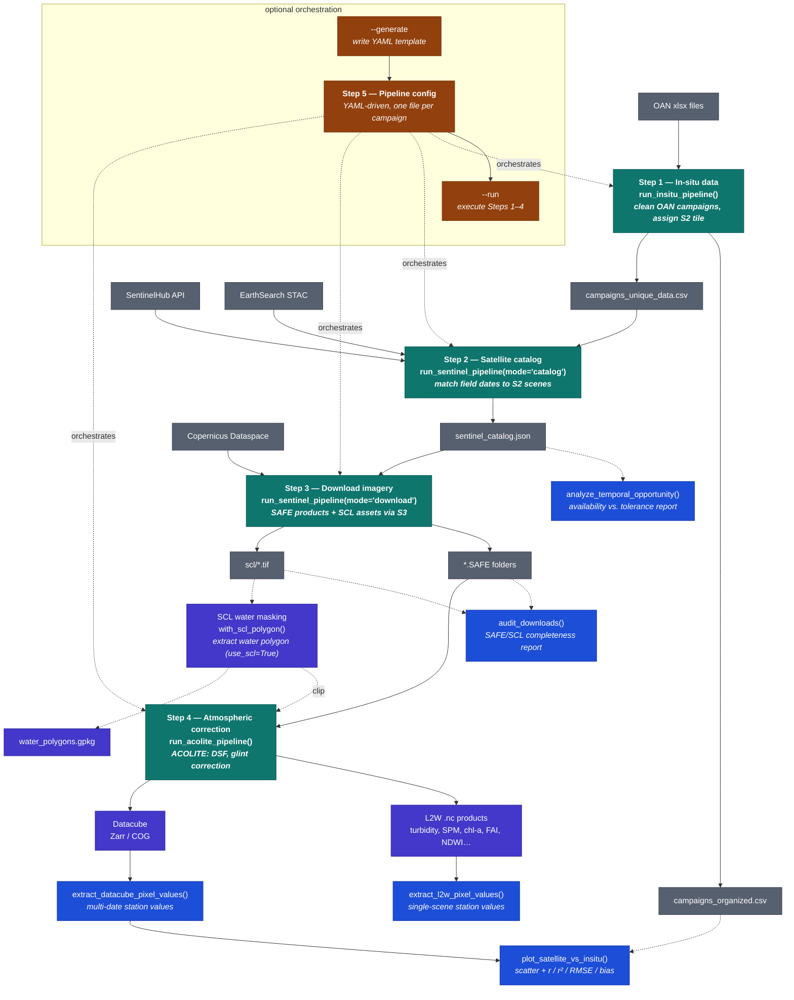

# Aquamatch Workflow

Source diagram for the "Overview" section of [`README.md`](./README.md). Edit this file (and copy the same Mermaid block into the README) whenever a step, artifact, or utility changes — no image regeneration needed.

**Color coding**: teal for the five pipeline steps, gray/neutral for data artifacts and external inputs, purple for the SCL/datacube/water-quality-product components, amber for the YAML orchestration layer, and blue for the analysis/validation utilities (`analyze_temporal_opportunity`, `audit_downloads`, `extract_l2w_pixel_values`, `extract_datacube_pixel_values`, `plot_satellite_vs_insitu`).
**Dashed arrows**: mark optional or indirect relationships — a pipeline output feeding one of the utilities above, the SCL polygon clip path (only when `use_scl=True`), and the Step 5 orchestration edges back to Steps 1–4 (since the YAML config drives the others rather than receiving data from them).
